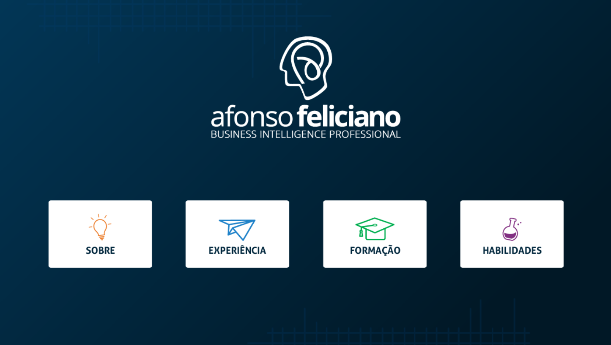
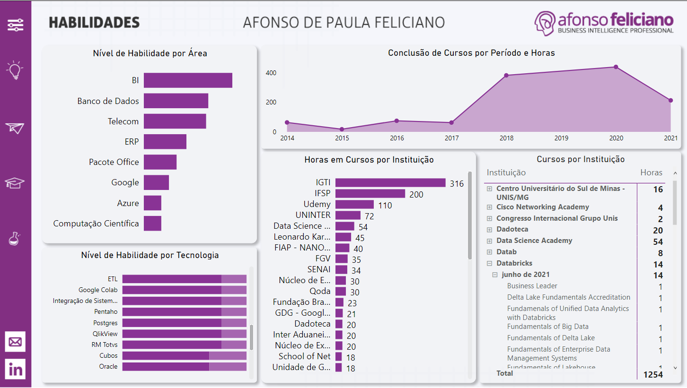

# PBI-CV-Afonso-Feliciano

Currículo desenvolvido em Power BI contemplando informações gerais, experiências profissionais, experiências acadêmicas e habilidades extras adquiridas através de cursos complementares. 

Para visualizar em detalhes cada aba, clique <a href="https://app.powerbi.com/view?r=eyJrIjoiNWI3ZWQxNTAtNWVmYi00ZjA0LWEwODgtNmIwMGViOGRlMTRhIiwidCI6ImY2OWYzNjJmLTYzYmQtNDFiOS04NDEzLWQxZmVlNzg1NmZmNyJ9&pageName=ReportSection10d439867880993540ed">aqui</a> 
 ou sobre as imagens abaixo. 

## Visão Geral
 

## Habilidades
 

